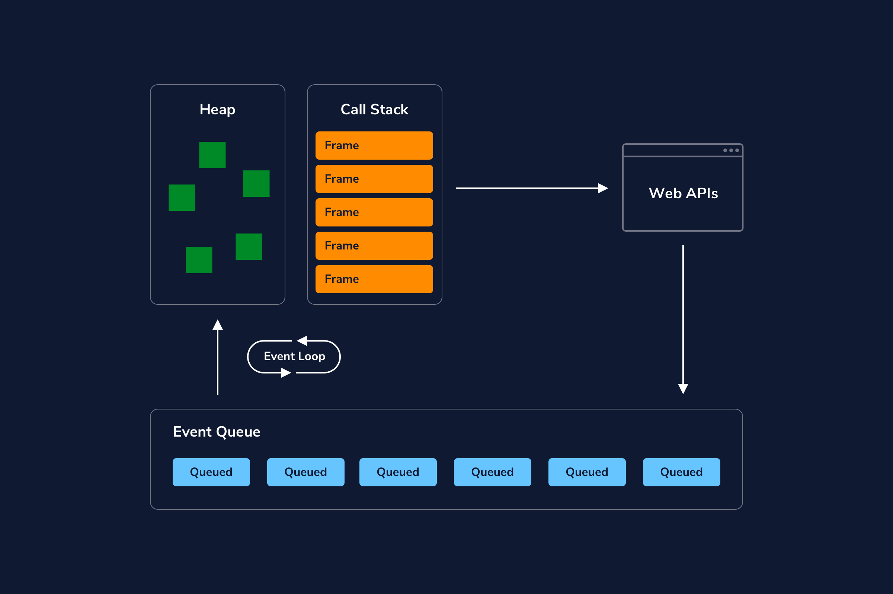

# The Javascript Event Loop
A system for managing code execution



* The **Heap** stores current variables and objects[^heap]
* The **Stack** tracks invoked functions[^stack]
* The **Event Queue** holds functions waiting to be added back to the Stack[^eventQueue]
* The **Event Loop** adds functions from the Event Queue to the Stack[^eventLoop] 


## Examples

Blocking vs. Non-Blocking 

```js
// Blocking:
console.log("I'm learning about");
 
for (let idx=0; idx < 999999999; idx++) {}
 
// The second console.log() statement is
// delayed by the for loop's execution
console.log("the Event Loop");
```


```js
// Non-Blocking:
console.log("I’m learning about");
setTimeout(() => { console.log("Event Loop");}, 2000);
console.log("the");
```

Describing Event Loop with code:
```js
const shopForBeans = () => {
  return new Promise((resolve, reject) => {
    const beanTypes = ['kidney', 'fava', 'pinto', 'black', 'garbanzo'];
    setTimeout(() => {
      let randomIndex = Math.floor(Math.random() * beanTypes.length);
      let beanType = beanTypes[randomIndex];
      console.log(`2. I bought ${beanType} beans because they were on sale.`);
      resolve(beanType);
    }, 1000);
  });
}
 
async function getBeans() {
  console.log(`1. Heading to the store to buy beans...`);
  let value = await shopForBeans();
  console.log(`3. Great! I'm making ${value} beans for dinner tonight!`);
}
 
getBeans();
console.log("Describe what happens with this `console.log()` statement as well.");
```


When the function getBeans() is called, getBeans() is added to the stack. The first console.log() statement is added to the stack, executes, and is popped off the stack. Next, the async function shopForBeans() is called and the return value is assigned to the variable value.

The response will be handled by the event queue and event loop and pushed back into the stack when it is cleared. The final log statement will then be added to the stack, log the argument, and pop off the stack.

The stack will be clear afterward, so the response event in the event queue will get added back to the stack and executed. The final two console.log() statements will then be added to the stack and popped off after logging their arguments.  


---

## References & Links
[MDN: Event Loop](https://developer.mozilla.org/en-US/docs/Web/JavaScript/EventLoop)

[latentflip.com loupe](http://latentflip.com/loupe/ "Loupe is a little visualisation to help you understand how JavaScript's call stack/event loop/callback queue interact with each other.")  | [Philip Roberts](http://twitter.com/philip_roberts) :bird:

[^heap]: The **heap** is a block of memory where we store objects in an unordered manner. JavaScript variables and objects that are currently in use are stored in the heap.

[^stack]: The **stack**, or call stack, tracks what function is currently being run in your code.
When you invoke a function, a frame is added to the stack. Frames connect that function’s arguments and local variables from the heap. Frames enter the stack in a last in, first out (LIFO) order.

[^eventQueue]: The **event queue** is a list of messages corresponding to functions that are waiting to be processed. In the diagram, these messages are entering the event queue from sources such as various web APIs[^API] or async functions that were called and are returning additional events to be handled by the stack. Messages enter the queue in a first in, first out (FIFO) order. No code is executed in the event queue; instead, it holds functions that are waiting to be added back into the stack.

[^eventLoop]: This **event loop** is a specific part of our overall event loop concept. Messages that are waiting in the event queue to be added back into the stack are added back via the event loop. When the call stack is empty, if there is anything in the event queue, the event loop can add those one at a time to the stack for execution.  
`1. First the event loop will poll the stack to see if it is empty.`  
`2. It will add the first waiting message.`  
`3. It will repeat steps 1 and 2 until the stack has cleared.`

[^API]: Application Programming Interface for the Web.  
Examples: YouTube API - Allows you to display videos on a web site. Twitter API - Allows you to display Tweets on a web site. Facebook API - Allows you to display Facebook info on a web site  
